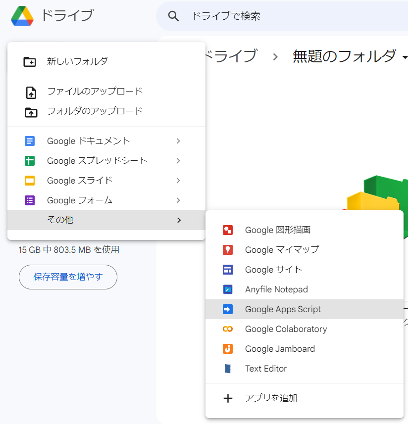
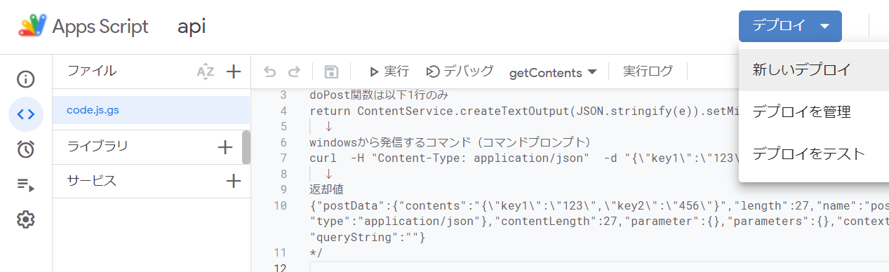
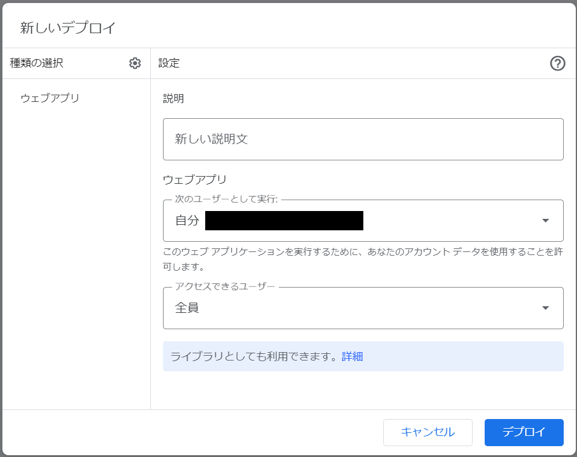
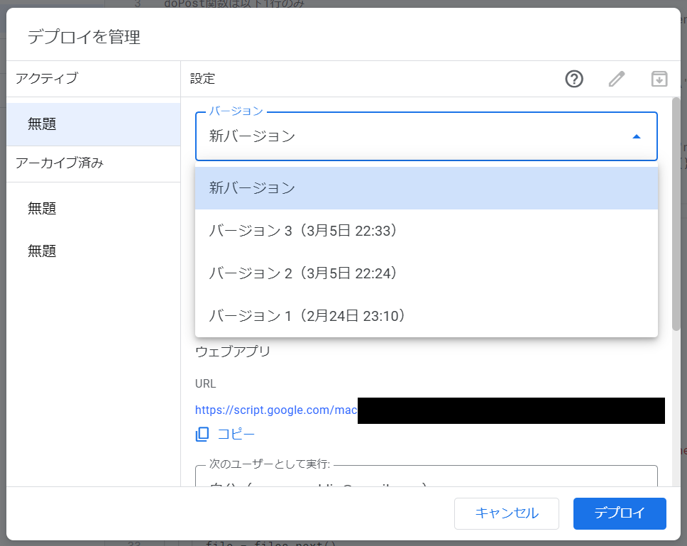

# Console.js
"Console.js" is a library designed to assist in debugging web applications.  
It embeds a console screen in the application and hooks "console.log" to display logs.  
In addition, some of the functions can be used on the application side for uses other than debugging.  

# Demo


# Sample
[Console.js - sample](https://syamcspublic.github.io/ConsoleJS/) ... This is the index.html of this repository.
- Very simple counter PWA that assumes the use of "Console.js".
- To check the behavior of "Console.js", many "console.log" are incorporated.
- It is using service worker and indexedDB.

By the way, [here](https://syamcspublic.github.io/ConsoleJS/simply.html) is a sample of simply loaded in an html file.

# Usage
```html
<script defer src="https://syamcspublic.github.io/ConsoleJS/Console.js"></script>
```
Or
```html
<script defer src="./Console.js"></script>
```
Simply load the "Console.js" available at github-pages as shown above in an html file.  
Or, download "Console.js" from this repository and load it.

Click or tap the "+" button displayed in the right bottom corner to display the console screen.  
The "@xx" command listed at the bottom of the console screen is available.

# Usage on the service worker
```javascript
importScripts("./Console.js")
Console.promise.then(async()=>{
  await Console.settings({storage:true})
  //any script synced with Console
})
//any script asynced with Console
```
To use it on the service worker side,  
it must be imported with "importScripts" as above and Console.settings.storage must be set to true (use indexedDB).

# Functions
```javascript
await Console.promise
```
The following functions will be available when "Console.promise" is resolved.

## settings ... function(json), return value is none
```javascript
await Console.settings({storage:true})
```
When "Console.js" is loaded, it is processed with default values, but the settings can be changed only once using "Console.settings".

> **Warning**  
> It may be called only once for each global object. Multiple calls may result in unintended behavior.

The keys and values of the arguments are as follows. If no key is specified, the default value is applied.
| key         | value                                                          | description
|-------------|----------------------------------------------------------------|-----------------
| `"storage"` | `true`(use), `false`(not use)                                  | indexedDB is used or not. default is `false`.
| `"show"`    | `true`(show), `false`(hide)                                    | show or hide the "+" button. default is `true`.
| `"pos"`     | `"right-bottom"`, `"right-top"`, `"left-bottom"`, `"left-top"` | position of the "+" button. default is `"right-bottom"`.
| `"posx"`    | (integer value)                                                | Change position of the "+" button(x direction). default is `0`.
| `"posy"`    | (integer value)                                                | Change position of the "+" button(y direction). default is `0`.


## storage ... object
```javascript
const app = Console.storage
await app.set("k1", "v1")            //set
let value1 = await app.get("k1")     //get
let lt = await app.get("_localtime") //get info data
let keys = await app.keys()          //get keys ... array
let jo = await app()                 //get keys&values ... json
await app.delete("k1")               //delete
```
The application can use some of the storage space used by "Console.js".  
Keys whose first character is "_" are processed by "ConsoleIDB.info", which is the system information of "Console.js".  
Other keys are handled by "ConsoleIDB.app" and should be used on the application side.  

The storage handled depends on the value of Console.settings.storage.  
- If true: indexedDB.
- If false: Objects automatically created directly under the global object.

The storage configuration is as follows.
```
"ConsoleIDB": {
  "app": {
    any
  },
  "info": {
    "settings": {
      "storage": [set value],
      "show": [set value],
      "pos": [set value],
      "posx": [set value],
      "posy": [set value],
    },
    "precmd": [previous command],
    "viewmode": [log view mode (all / sw / other than sw)],
    "posturl": [the URL of the post destination],
    "postname": [post destination file name],
    "sendtime": [send time],
    "recvtime": [receive time],
    "localtime": [storage update time],
  },
  "logsw": {
    [timestamp]: [log contents],
  },
  "logwin": {
    [timestamp]: [log contents],
  },
},
```

## setfuncs ... array
```javascript
Console.setfuncs.push(()=>{
  console.info("storage set")
})
```
Can add functions that you want to run when `Console.storage.set(any)` is called.   
It will also be executed when console.log is called.

## deletelog ... function(), return value is true
```javascript
await Console.deletelog()
```
Delete log.

## posturl ... function(string), return value is string(posturl)
```javascript
pu = await Console.posturl() //get
pu = "https://..."
await Console.posturl(pu)    //set
```
The URL of the post destination for postsend/postrecv. See [How to create a post destination](#how-to-create-a-post-destination).

## postname ... function(string), return value is string(postname)
```javascript
pn = await Console.postname() //get
pn = "postname1"
await Console.postname(pn)    //set
```
Post destination file name.

## postsend ... function(), return value is string(postname)
```javascript
await Console.postsend()
```
Sends the entire contents of "ConsoleIDB" including logs to post.  
If postname is not set, the assumption is that it is automatically retrieved at the post destination.  
When the send is started, "ConsoleIDB.info.sendtime" is updated.  
When the send is complete, "ConsoleIDB.info.postname" is updated.

## postrecv ... function(), return value is json(ConsoleIDB.app)
```javascript
await Console.postrecv()
```
Receive "ConsoleIDB.app" from the post destination.  
When the receive is completed, "ConsoleIDB.app" and "ConsoleIDB.info.recvtime" are updated.

# How to create a post destination
Brief description of how to create a post destination using GAS.

1. Create a "Google Apps Script" file in GoogleDrive and open the file.

   

2. Copy and paste the "gas.js" code from this repository into the script file.

3. Set the "folderid" value to the ID of the folder where the data will be saved after transmission, and save it.

4. Click the "Deploy" triangle button in the right top.

5. Click "New Deploy".

   

6. Select "Web App" from the gear in the left top.

7. "Run as the following user" is myself and "Accessible users" is everyone. (please change the setting values as needed)

8. Click the "Deploy" button on the right bottom to get the URL of the post destination.

   

The second and subsequent deployments should be performed as follows. (How to deploy without changing the URL)

1. Click the "Deploy" triangle button in the right top.

2. Click the "Manage Deploy".

3. Click the pencil icon in the right top.

4. select "New Version".

5. Click the "Deploy" button in the right bottom.

   

# Note
Most functions are async.  
See the samples in this repository for specific use cases.

# Author
sYamcs

# License
MIT
